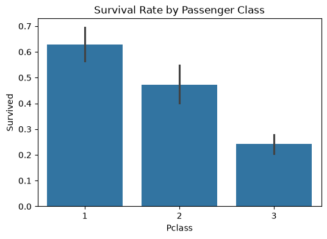
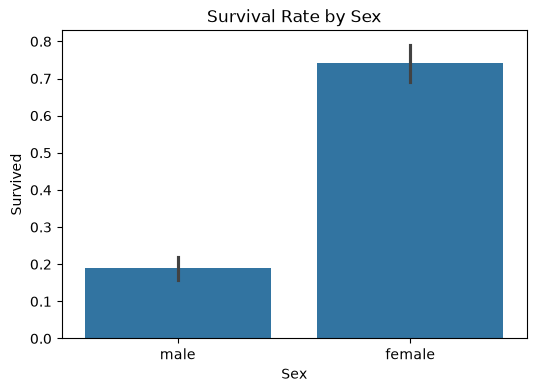

#  Titanic Survival Dashboard

An end-to-end data science project: exploratory data analysis, a machine learning
model, and an interactive Streamlit dashboard predicting Titanic passenger survival.

## Overview
This project uses the classic Titanic dataset to explore what factors most
influenced passenger survival, train a classification model, and let users
interactively predict survival odds for a hypothetical passenger.

## Key Results
- Trained a Random Forest Classifier reaching **~82.1% accuracy** on held-out test data
- Found passenger class, sex, and age were the strongest predictors of survival
- Built an interactive dashboard for data exploration and live prediction

## Screenshots

## Tech Stack
- Python, pandas, numpy
- scikit-learn (Random Forest)
- matplotlib, seaborn
- Streamlit (dashboard)

## How to Run
\`\`\`bash
git clone https://github.com/bluebeard3000/Titanic-survival-dashboard.git
cd titanic-survival-dashboard
pip install -r requirements.txt
python3 eda.py
python3 model.py
streamlit run app.py
\`\`\`

## Project Structure
\`\`\`
├── data/train.csv       # dataset
├── eda.py                # exploratory data analysis + chart generation
├── model.py               # model training
├── app.py                 # Streamlit dashboard
├── images/                 # saved chart outputs
└── requirements.txt
\`\`\`